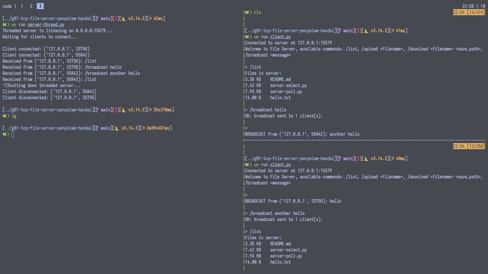

[](https://classroom.github.com/a/mRmkZGKe)
# Network Programming - Assignment G01

## Anggota Kelompok
| Nama                        | NRP        | Kelas     |
| ---                         | ---        | ----------|
| Jalu Cahyo Senodiputro      | 5025241155 |    C      |
| Erlangga Rizqi Dwi Raswanto | 5025241179 |    C      |

## Link Youtube (Unlisted)
Link ditaruh di bawah ini
```
https://youtu.be/inV3pSt1Jws
```

## Penjelasan Program

Repo ini adalah implementasi tugas **TCP File Server** berbasis terminal dengan 4 model server dan 1 client:
- `server-sync.py` → synchronous (satu client dalam satu waktu)
- `server-thread.py` → multi-client dengan `threading`
- `server-select.py` → multi-client non-blocking dengan `select`
- `server-poll.py` → multi-client non-blocking dengan `poll`
- `client.py` → client interaktif untuk menjalankan command

Semua implementasi server memakai protokol yang sama (line-based + payload biner), sehingga client yang sama bisa dipakai untuk semua varian server.

### 1. client.py
Program client digunakan untuk terhubung ke server dan mengirim perintah dari terminal.

Fitur utama:
- `/list`: meminta daftar file yang tersedia di folder server.
- `/upload <filepath>`: mengunggah file lokal ke server.
- `/download <filename> <save_path>`: mengunduh file dari server ke path lokal.
- `/broadcast <message>`: mengirim pesan broadcast ke semua client lain yang sedang terhubung.
- `/exit`: keluar dari client.

Alur protokol client:
- Client *connect* ke server.
- User menuliskan command di client yang kemudian dikirimkan ke server.
- Client menerima dan menampilkan *response* dari server.

Detail implementasi:
- Client menjalankan `select.select([sock, sys.stdin], [], [])` agar bisa membaca input user **dan** pesan server (mis. broadcast) secara bersamaan.
- `recv_non_broadcast_line()` dipakai untuk memastikan respon handshake (`READY_FOR_SIZE`, `READY_FOR_UPLOAD`, `SIZE ...`) tidak tercampur dengan pesan `BROADCAST ...`.
- Untuk `/list`, client membaca header `LIST <payload_size>` lalu mengambil payload persis sejumlah byte tersebut.
- Parsing command `/download` memakai `rsplit(' ', 1)` agar pemisahan `filename` dan `save_path` lebih aman.

### 2. server-sync.py
Implementasi pada server sinkron dibagi menjadi beberapa fungsi inti:

- `send_line(conn, text)`: mengirim 1 baris pesan teks dengan akhiran newline.
- `recv_line(conn, buffer)`: membaca data dari socket sampai menemukan newline, lalu mengembalikan 1 baris command + sisa buffer.
- `recv_exact(conn, size, buffer)`: membaca tepat sejumlah byte (dipakai untuk isi file saat upload/download).
- `sanitize_filename(filename)`: validasi nama file agar hanya nama file biasa.
- `format_size_notation(file_size)`: mengubah size bytes menjadi notasi `B/KB/MB/GB/TB` dengan pembulatan ke atas.
- `handle_list(conn)`: membaca isi folder `server_files`, menampilkan **size + filename** yang rapi, lalu kirim `LIST <size>` diikuti payload daftar file.
- `handle_upload(conn, filename, buffer)`: handshake upload (`READY_FOR_SIZE` -> terima size -> `READY_FOR_UPLOAD` -> terima byte file -> simpan ke disk).
- `handle_download(conn, filename, buffer)`: handshake download (kirim `SIZE` -> tunggu `READY_FOR_DOWNLOAD` -> kirim isi file).
- `handle_client(conn, addr)`: loop utama parsing command (`/list`, `/upload`, `/download`) dan pilih handler yg sesuai.
- `main()`: setup socket server (`SO_REUSEADDR`, `bind`, `listen`), menerima koneksi, lalu memproses client satu per satu.

Catatan:
- Karena synchronous, server baru bisa menerima client lain setelah client saat ini selesai/disconnect.
- Cocok untuk baseline implementasi protokol karena alurnya paling mudah di-trace.

### 3. server-thread.py
Struktur fungsinya sama dengan *server-sync* (`send_line`, `recv_line`, `recv_exact`, `handle_list`, `handle_upload`, `handle_download`, `handle_client`), tetapi pada `main()` implementasinya berbeda:

- Server menerima koneksi dari `accept()`.
- Setiap koneksi dijalankan di thread baru dengan `threading.Thread(target=handle_client, ...)`.
- Daftar worker thread disimpan dan dibersihkan dari thread yang sudah selesai (`is_alive()`).
- Saat `KeyboardInterrupt`, server ditutup lalu thread-thread yang masih aktif di-*join* dengan timeout.
- Koneksi aktif dikelola di `CLIENTS` + `CLIENTS_LOCK` untuk kebutuhan broadcast thread-safe.

Dengan begitu, alur command per client tetap sama seperti sync, tetapi diproses di thread terpisah.

Selain command file transfer, pada server multi-client (`server-thread.py`, `server-select.py`, `server-poll.py`) juga ditambahkan handler `/broadcast <message>` untuk mengirim pesan ke semua client lain yang sedang aktif.

### 4. server-select.py
Server ini memakai event loop non-blocking berbasis `select.select()`.

Implementasi utamanya:
- Socket server di-set non-blocking (`setblocking(False)`).
- Data client disimpan dalam dictionary `clients`, berisi:
	- `in_buffer` dan `out_buffer`
	- `state` (`COMMAND`, `WAIT_UPLOAD_SIZE`, `WAIT_UPLOAD_CONTENT`, `WAIT_DOWNLOAD_ACK`)
	- metadata upload (`pending_filename`, `upload_size`, `upload_received`, `upload_file`)
- `queue_line()` dan `queue_bytes()` dipakai untuk menaruh data respons ke `out_buffer`.
- `process_client_buffer(client, clients)` menjalankan state machine protokol:
	- state `COMMAND`: parse command baris-per-baris
	- state upload: validasi size lalu tulis byte file bertahap
	- state download: tunggu ACK lalu antrekan byte file ke `out_buffer`
	- state command juga menangani `/broadcast` ke client lain
- Di loop `main()`, `select.select()` menghasilkan:
	- `readable`: terima koneksi baru atau baca data client
	- `writable`: kirim data yang menunggu di `out_buffer`
	- `exceptional`: tutup koneksi bermasalah lewat `close_client()`

Kelebihan:
- Single-threaded event loop (lebih hemat thread).
- Cocok untuk banyak koneksi idle dengan throughput I/O tinggi.

### 5. server-poll.py
Implementasi server ini hampir sama dengan `server-select.py`, tetapi event multiplexer diganti ke `select.poll()`.

Detail implementasi:
- Server dan client socket diregister ke objek `poller`.
- `fd_map` dipakai untuk memetakan file descriptor ke objek socket.
- `update_interest(poller, sock, client)` mengatur event yang dipantau:
	- selalu `POLLIN`
	- tambah `POLLOUT` jika `out_buffer` tidak kosong
- Di loop `main()`, `poller.poll()` membaca event lalu diproses:
	- event server: accept banyak koneksi selama masih tersedia
	- `POLLIN`: baca data dan proses state machine
	- `POLLOUT`: flush data dari `out_buffer`
	- `POLLHUP/POLLERR/POLLNVAL`: koneksi ditutup aman
	- command `/broadcast` di-handle pada state `COMMAND` dan di-queue ke seluruh client lain

State machine command upload/download/list pada `server-poll.py` sama dengan versi select, hanya mekanisme event-nya yang berbeda (`poll` alih-alih `select`).

Kelebihan:
- Skalabilitas event monitoring lebih baik dibanding `select` pada banyak FD.
- Tetap mempertahankan protokol command yang sama seperti varian server lain.


### Command Protokol
1. List file
	- Client: `/list`
	- Server: `LIST <panjang_payload>` lalu isi daftar file.
	- Format payload list:
		- `<size_notation>    <filename>`
		- contoh: `532.00 B      catatan.txt`
		- contoh: `1.25 MB      video.mp4`

2. Upload file
	- Client: `/upload <filename>`
	- Server: `READY_FOR_SIZE`
	- Client: `<file_size>`
	- Server: `READY_FOR_UPLOAD`
	- Client: kirim byte file
	- Server: balasan `OK` atau `ERR`

3. Download file
	- Client: `/download <filename>`
	- Server: `SIZE <file_size>` atau `ERR`
	- Client: `READY_FOR_DOWNLOAD`
	- Server: kirim byte file

4. Broadcast pesan (khusus server multi-client)
	- Client pengirim: `/broadcast <message>`
	- Server: kirim `BROADCAST ...` ke semua client lain
	- Server ke pengirim: `OK: broadcast sent to <N> client(s).`

Ilustrasi handshake inti:

`/list`
```
Client                          Server
	|--- /list\n ----------------->|
	|<-- LIST <size>\n ------------|
	|<-- <payload bytes> ----------|
```

`/upload <filename>`
```
Client                          Server
	|--- /upload nama.txt\n ------>|
	|<-- READY_FOR_SIZE\n ---------|
	|--- <file_size>\n ----------->|
	|<-- READY_FOR_UPLOAD\n -------|
	|--- <raw file bytes> -------->|
	|<-- OK / ERR\n ---------------|
```

`/download <filename> <save_path>`
```
Client                          Server
	|--- /download nama.txt\n ---->|
	|<-- SIZE <file_size>\n -------|
	|--- READY_FOR_DOWNLOAD\n ---->|
	|<-- <raw file bytes> ---------|
```

### Keamanan dan Validasi Dasar
- Nama file disanitasi agar tidak bisa mengakses path di luar folder server.
- Ukuran file divalidasi saat upload.
- Jika transfer tidak lengkap, server mengirim pesan error.
- Folder `server_files` dibuat otomatis saat server start (`check_dir()`).
- Parsing berbasis buffer (`recv_line` + `recv_exact`) memastikan data TCP stream tidak tertukar antar command.
- Pada `/list`, yang ditampilkan hanya file (bukan subdirectory) untuk menjaga konsistensi output.

## Screenshot Hasil

### server-sync.py


### server-poll.py


### server-select.py


### server-thread.py


### broadcast


